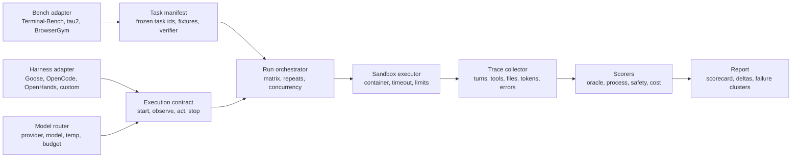
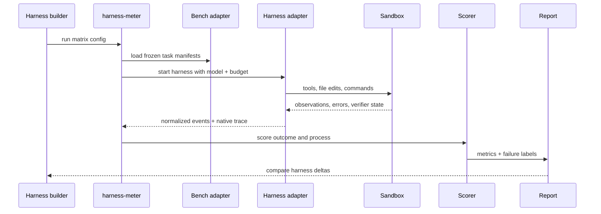

# Harness Meter Brainlift + Presearch

Date: 2026-07-05

## Brainlift

The useful unit is not "model score." It is:

```text
agent result = model + harness + task environment + budget + evaluator
```

The harness is the execution layer around the model:

- context construction
- planning loop
- tool adapters
- shell/browser/API permissions
- workspace state
- memory and checkpoints
- retries and recovery
- artifact contracts
- trace logging
- final verifier handoff

Most public leaderboards hide this. They compare complete agents, or they hold one harness fixed and swap models. That is useful for model marketing, but weak for engineering. If you are building an agent bench system, the question is:

```text
With the same task, model, budget, and verifier, which harness converts reasoning into verified work most reliably and cheaply?
```

## Existing Landscape

| Project | What it gives | Harness-measurement value | Caveat |
| --- | --- | --- | --- |
| [Harness-Bench](https://arxiv.org/html/2605.27922v1) | Direct harness-focused benchmark paper with 106 sandboxed offline tasks and trace/process/failure metrics | Best conceptual target | Paper first; use ideas, verify repo maturity before depending on it |
| [scaffold-effects](https://github.com/namanvats/scaffold-effects) | Runnable comparison of Goose, OpenCode, OpenHands SDK on Terminal-Bench Pro slice | Best existing OSS seed for harness deltas | Tiny adoption surface; 50-task slice |
| [HAL harness](https://github.com/princeton-pli/hal-harness) | Unified CLI across SWE-bench, AppWorld, CORE-bench, tau-bench, cost/traces | Good architecture reference | Archived |
| [Terminal-Bench](https://github.com/harbor-framework/terminal-bench) | Real terminal tasks with sandbox and task verifiers | Best MVP environment for coding/ops harnesses | Heavy tasks, can be expensive |
| [BrowserGym](https://github.com/ServiceNow/BrowserGym) | Web-agent Gym covering MiniWoB, WebArena, VisualWebArena, WorkArena, AssistantBench, WebLINX, OpenApps, TimeWarp | Good browser harness adapter target | Environment setup complexity |
| [tau2-bench](https://github.com/sierra-research/tau2-bench) | Simulated customer-service domains with policies, tools, tasks, user simulator | Measures tool-user interaction, policy following, multi-turn reliability | More domain-specific |
| [ToolSandbox](https://github.com/apple/ToolSandbox) | Stateful tool execution, implicit state dependencies, user simulator, dynamic milestones | Good for recovery/state/tool correctness | Less broad than terminal/browser benches |
| [AppWorld](https://github.com/StonyBrookNLP/appworld) | 9 simulated apps, 457 APIs, 750 autonomous tasks | Strong API/app-world harness stress test | More setup and task integration work |
| [OSWorld](https://github.com/xlang-ai/OSWorld) | Real computer environment benchmark for multimodal agents | Future GUI/computer-use track | Operationally heavy |
| [Inspect AI](https://inspect.aisi.org.uk/) | Eval framework with agents, tools, sandboxes, scorers, logs, external agents | Best OSS base for writing rigorous eval runners | Need custom harness adapters |
| [Langfuse](https://github.com/langfuse/langfuse) | OSS tracing, evals, datasets, scores | Best product observability layer | Not the benchmark runner itself |
| [Promptfoo](https://github.com/promptfoo/promptfoo) | CLI evals, red teaming, CI | Useful for CI smoke checks | Less suited to long-horizon agent trajectories |

## Alignment Decision

Build a harness measurement tool, not a new model leaderboard.

Borrow:

- Harness-Bench framing: report model-harness configuration, not base model alone.
- scaffold-effects experiment shape: same tasks, same models, same sandbox, compare harnesses.
- Terminal-Bench task format: instruction, sandbox, verifier script, oracle solution.
- Inspect AI architecture: task, solver/agent, scorer, logs, sandbox.
- Langfuse trace model: spans, costs, observations, scores, dataset runs.

Avoid:

- A single "agent IQ" score.
- LLM-judge-only grading.
- Live-web tasks for the first version.
- Uncontrolled "best of N" unless explicitly labeled.
- Mixing harness changes with model, tool, prompt, and budget changes in the same comparison.

Strongest direction signal:

```text
Harness Meter should be a regression lab for agent harness builders.
The first user is someone changing their agent loop and needing proof it got better.
```

## Recommended Product

Name: `harness-meter`

One-line promise:

```text
Run the same agent tasks through multiple harnesses and show pass rate, cost, latency, recovery, trace quality, and failure fingerprints.
```

CLI shape:

```bash
harness-meter run \
  --bench terminal-bench:core20 \
  --models openai/gpt-5.3,anthropic/claude-sonnet-4.6 \
  --harnesses opencode,openhands,goose,my-harness \
  --budget turns=40,tokens=200000,timeout=30m \
  --repeats 3 \
  --out runs/tbench-core20
```

Outputs:

```text
runs/tbench-core20/
  manifest.json
  scores.csv
  trajectories.jsonl
  failures.jsonl
  artifacts/
  native-traces/
  report.html
```

## Decision Matrix

| Option | Description | Pros | Cons | Recommendation |
| --- | --- | --- | --- | --- |
| A. Build on Inspect AI | Use Inspect as runner/scorer/log substrate, write external-agent adapters | Strong eval primitives, sandboxes, external agents, logs | Some impedance mismatch with existing benchmark CLIs | Best long-term base |
| B. Build directly on Terminal-Bench | Wrap `tb run`, normalize outputs | Fastest MVP, simplest story | Harder to generalize beyond terminal | Best first slice |
| C. Fork HAL harness | Reuse multi-bench abstraction | Good cross-bench ideas | Archived, dependency drift | Study, do not fork |
| D. Custom runner from scratch | Full control | Clean product fit | Slow, risks rebuilding eval infra | Avoid for MVP |

Recommended:

```text
Slice 1: direct Terminal-Bench wrapper.
Slice 2: internal normalized schema.
Slice 3: Inspect AI task runner integration.
Slice 4: BrowserGym and tau2 adapters.
```

## System Design



## Core Abstractions

### Task

```json
{
  "task_id": "terminal-bench/core20/build-async-debug",
  "domain": "terminal",
  "instruction": "Fix the failing async test suite.",
  "sandbox_image": "ghcr.io/bench/task:sha",
  "verifier": "tests/run.sh",
  "success_contract": ["tests pass", "required artifact exists"],
  "budget": {"turns": 40, "timeout_seconds": 1800}
}
```

### Harness Adapter

```json
{
  "harness": "openhands-sdk",
  "version": "sha-or-release",
  "capabilities": ["shell", "edit", "file_read"],
  "entrypoint": "python -m adapters.openhands",
  "config": {
    "planning": "native",
    "memory": "native",
    "approval_policy": "none",
    "max_turns": 40
  }
}
```

### Trajectory Event

```json
{
  "run_id": "2026-07-05-tbench-core20-001",
  "task_id": "terminal-bench/core20/build-async-debug",
  "model": "openai/gpt-5.3",
  "harness": "openhands-sdk",
  "turn": 12,
  "event_type": "tool_result",
  "tool": "bash",
  "status": "error",
  "latency_ms": 1832,
  "tokens_in": 8120,
  "tokens_out": 914,
  "cost_usd": 0.042,
  "workspace_diff_hash": "sha256:..."
}
```

## Scorecard

Primary metrics:

| Metric | Definition | Why it matters |
| --- | --- | --- |
| `oracle_pass` | Verifier says task succeeded | Hard outcome |
| `cost_per_solved` | total spend / solved tasks | Harness efficiency |
| `tokens_per_solved` | total tokens / solved tasks | Context discipline |
| `wall_time_per_solved` | elapsed time / solved tasks | User experience |
| `turns_per_solved` | turns / solved tasks | Loop efficiency |
| `timeout_rate` | runs killed by timeout | Long-horizon failure |
| `tool_error_recovery_rate` | tool errors followed by successful corrective action | Harness recovery |
| `artifact_commit_rate` | required outputs actually written | Intent to artifact conversion |
| `trace_completeness` | required event fields present | Auditability |
| `safety_violation_rate` | blocked command, secret leak, forbidden network, policy breach | Deployment risk |

Secondary diagnostics:

- missing file/artifact
- malformed schema
- ignored tool feedback
- no-progress loops
- repeated same command
- evidence claim without source
- modifies wrong file
- fails to call completion API
- success message but failed verifier

Composite score:

```text
harness_score =
  0.45 oracle_pass
+ 0.15 efficiency_score
+ 0.15 recovery_score
+ 0.10 traceability_score
+ 0.10 artifact_score
+ 0.05 safety_score
```

Keep this composite secondary. The product should lead with raw metrics and deltas.

## Harness Delta Protocol

For a fair harness comparison:

1. Freeze task set.
2. Freeze model backend and model settings.
3. Freeze sandbox image.
4. Freeze budget.
5. Freeze evaluator.
6. Run at least 3 repeats when cost allows.
7. Report confidence intervals or at least per-task variance.
8. Store raw trajectories.
9. Publish harness config hash.
10. Label any native feature advantage, such as built-in repo map or browser memory.

Bad comparison:

```text
Harness A + GPT-5.3 + 80 turns vs Harness B + Claude + 40 turns
```

Good comparison:

```text
Harness A + GPT-5.3 + 40 turns vs Harness B + GPT-5.3 + 40 turns
Harness A + Claude + 40 turns vs Harness B + Claude + 40 turns
```

## Concrete End-to-End Example

Task:

```text
Fix a failing async Python service in a Docker sandbox.
Verifier: pytest tests/test_async_retry.py
Budget: 40 turns, 30 minutes, 200k tokens
Models: GPT-5.3, Claude Sonnet 4.6
Harnesses: OpenHands SDK, Goose, OpenCode, MyHarness
Repeats: 3
```

Run lifecycle:

1. `harness-meter` resolves task fixture and sandbox image.
2. It starts each harness through an adapter contract.
3. Adapter injects instruction and model config.
4. Harness acts normally: read, edit, shell, inspect, retry.
5. Runner records normalized events plus native traces.
6. Sandbox runs verifier after stop or timeout.
7. Scorers compute outcome, efficiency, recovery, safety, traceability.
8. Report clusters failures.

Example finding:

```text
OpenCode solved 13/20 at $0.82 per solve.
OpenHands solved 15/20 at $2.75 per solve.
MyHarness solved 14/20 at $0.96 per solve, but had 2 artifact-commit failures.

Decision:
Borrow OpenHands recovery pattern, keep MyHarness context packer, add artifact contract checker.
```

## Product Workflow



## MVP Slices

### Slice 1: Walking Skeleton

Goal:

```text
One local task, two fake harness adapters, one deterministic verifier, one score report.
```

Build:

- `harness-meter init`
- task manifest loader
- `echo-pass` adapter
- `echo-fail` adapter
- JSONL trajectory writer
- deterministic scorer
- Markdown report

Proof:

```bash
harness-meter run --bench examples/minibench --harnesses echo-pass,echo-fail
```

### Slice 2: Terminal-Bench Adapter

Goal:

```text
Run a small Terminal-Bench slice through one real harness.
```

Build:

- task subset resolver
- sandbox command runner
- verifier parser
- timeout handling
- artifact capture

Proof:

```bash
harness-meter run --bench terminal-bench:smoke5 --harnesses opencode --models one-provider-model
```

### Slice 3: Harness Matrix

Goal:

```text
Same task/model/budget across 3 harnesses.
```

Build:

- adapter registry
- config hashing
- repeated runs
- cost/tokens normalization
- report table

Proof:

```bash
harness-meter compare --baseline opencode --candidate my-harness
```

### Slice 4: Failure Fingerprints

Goal:

```text
Explain why harnesses fail differently.
```

Build:

- deterministic detectors first
- optional LLM-assisted labels second
- per-task failure cards

Labels:

- contract format
- tool recovery
- evidence grounding
- artifact commitment
- state continuation
- safety/permission

### Slice 5: Product UI

Goal:

```text
A report a harness author can send to a team.
```

Build:

- static HTML report
- task drilldown
- trajectory timeline
- cost waterfall
- failure cluster board
- config diff view

## Implementation Architecture

```text
packages/
  harness_meter/
    cli.py
    config.py
    manifests.py
    runner.py
    scoring.py
    reporting.py
    adapters/
      bench_terminal_bench.py
      bench_minibench.py
      harness_cli.py
      harness_openhands.py
      harness_goose.py
      harness_opencode.py
    schemas/
      run_manifest.schema.json
      trajectory_event.schema.json
      score.schema.json
examples/
  minibench/
    tasks/
    adapters/
runs/
docs/
```

Use Python for the runner. Use `uv`. Keep adapters subprocess-based first so the tool can evaluate arbitrary harnesses without forcing a framework.

## Trace And Observability

Use Langfuse or OpenTelemetry-style spans for product telemetry, but keep local JSONL as the source of truth.

Trace hierarchy:

```text
experiment
  run
    task
      harness_session
        model_call
        tool_call
        file_event
        verifier_event
        scorer_event
```

Required fields:

- run id
- task id
- harness id and version
- model id and provider
- config hash
- sandbox image digest
- timestamp
- event type
- parent span id
- cost/tokens/latency when available
- workspace diff hash
- output artifact paths

## Evaluation Policy

Use this grading order:

1. Deterministic verifier.
2. Environment-state check.
3. Artifact schema validation.
4. Static detectors for failure fingerprints.
5. LLM judge only for process notes and clustering.
6. Human review only for disputed failures and benchmark calibration.

Do not let the model judge itself. Do not use a single judge score as the headline.

## Product Positioning

Category:

```text
Agent harness regression testing
```

Audience:

- agent framework maintainers
- internal platform teams
- coding-agent builders
- eval engineers
- AI infra teams comparing orchestration loops

Messaging:

```text
Stop asking which model won.
Ask which harness made the same model do verified work.
```

Moat:

- normalized cross-harness event schema
- adapters for real OSS benches
- failure fingerprints, not just pass rate
- config hashing and reproducible run bundles
- reports good enough for PR review and release gates

## Open Questions

1. Which first harnesses matter most to Max: Codex CLI, Claude Code, OpenHands, OpenCode, Goose, custom Hermes/OpenClaw?
2. Should the first public wedge be coding agents only, or generic agent harnesses?
3. Should reports optimize for local CI or public leaderboard submission?
4. What is the spend ceiling per benchmark run?
5. Should Langfuse be bundled, optional, or replaced by local-only traces for the OSS core?

## Recommended Next Step

Build `minibench` first:

```text
5 local filesystem/shell tasks
2 toy harnesses
1 real CLI harness adapter
deterministic verifiers
JSONL trace schema
static HTML report
```

Then plug in Terminal-Bench smoke tasks. Do not start with BrowserGym or OSWorld. They are valuable later, but too much setup for the first proof.

## Sources

- [Harness-Bench paper](https://arxiv.org/html/2605.27922v1)
- [scaffold-effects repo](https://github.com/namanvats/scaffold-effects)
- [HAL harness repo](https://github.com/princeton-pli/hal-harness)
- [Terminal-Bench repo](https://github.com/harbor-framework/terminal-bench)
- [BrowserGym repo](https://github.com/ServiceNow/BrowserGym)
- [tau2-bench repo](https://github.com/sierra-research/tau2-bench)
- [ToolSandbox repo](https://github.com/apple/ToolSandbox)
- [AppWorld repo](https://github.com/StonyBrookNLP/appworld)
- [OSWorld repo](https://github.com/xlang-ai/OSWorld)
- [Inspect AI docs](https://inspect.aisi.org.uk/)
- [Langfuse repo](https://github.com/langfuse/langfuse)
- [Promptfoo repo](https://github.com/promptfoo/promptfoo)

